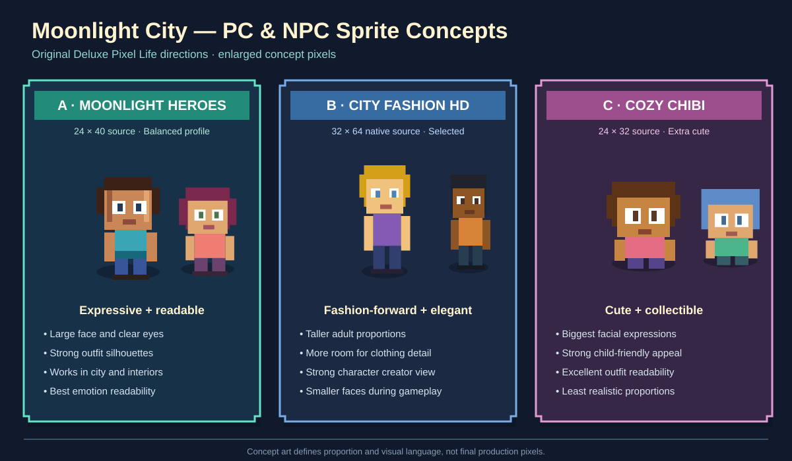
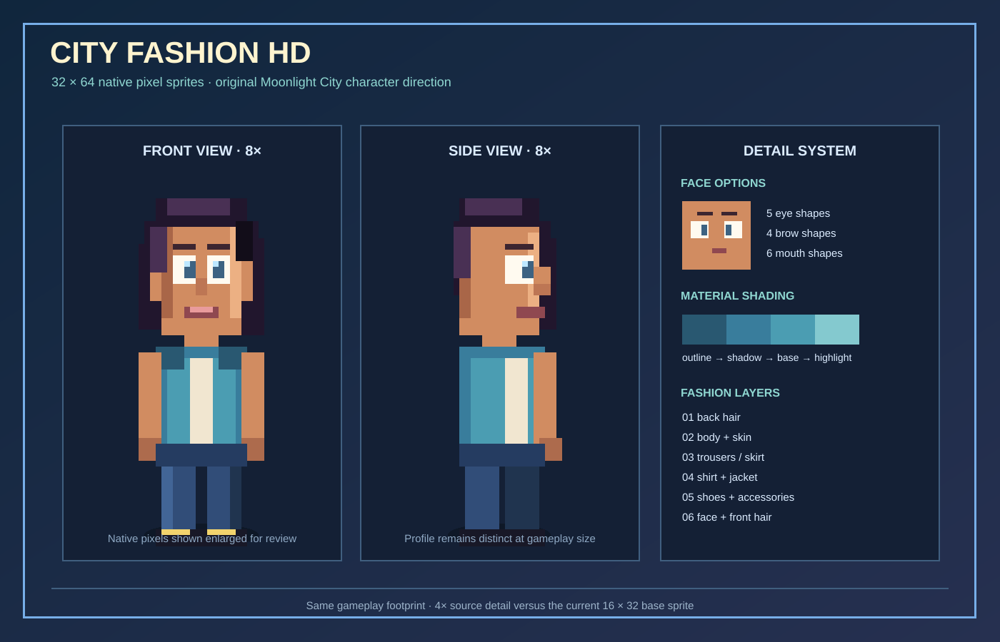

# Moonlight City - PC and NPC Sprite Redesign

> **Revised selection:** City Fashion HD

## Purpose

Redesign every playable character and NPC around the selected **Deluxe Pixel Life** direction. Characters should feel expressive, fashionable, and easy to identify while remaining readable in Moonlight City's top-down canvas world.

The concepts are original. They use broad life-simulation principles such as expressive faces, modular outfits, strong silhouettes, and readable emotions without copying another game's characters, assets, animations, or exact style.

## Current problems to solve

- Adult sprites mix large anime eyes with a compact farming-game body.
- Toddler, child, and adult proportions do not feel like one visual family.
- NPC identity depends heavily on colour instead of silhouette and accessories.
- Clothing has too little space for recognizable fashion details.
- Emotional state is mostly communicated through dialogue rather than animation.
- Character creation shows options, but face and outfit differences are limited.

## Concept A - Moonlight Heroes

Use a **24 × 40 source sprite**, displayed at 2× scale in the city and 3–4× in portraits and character creation.

### Proportions

- Head: 20 × 20 pixels
- Torso: 14 × 11 pixels
- Legs: 6 × 8 pixels each
- Hands and shoes use exaggerated highlight pixels
- Eyes remain large enough to show mood without dominating the face

### Strengths

- Best balance between expression and world readability
- Enough space for jackets, dresses, uniforms, jewellery, and bags
- Works with the current collision boxes and 32-pixel map grid
- Supports distinct adult, child, and toddler variants
- Feels like a major upgrade without forcing map reconstruction

### NPC differentiation

Each named NPC receives:

- A unique hair silhouette
- One signature accessory
- A two-colour outfit palette
- A unique idle pose
- A small reaction animation

Examples: Ella adjusts her apron, Lumi checks a paintbrush, Rex folds his arms, Rose's coat moves in an unseen breeze, and Doc checks a clipboard.

## Concept B - City Fashion HD

**Selected and revised**

Use a **32 × 64 native source sprite** with taller bodies, expressive faces, and substantially more clothing detail. It occupies approximately the same gameplay footprint as the current upscaled sprite, but every visible pixel can carry unique information instead of being doubled.

### Proportions

- Head: 24 × 24 pixels
- Torso: 18 × 20 pixels
- Legs: 7 × 18 pixels each
- Hands: 4 × 5 pixels with pose variants
- Narrower shoulders, longer silhouette, and clear waist line
- Rendered at native 32 × 64 in the world and 3× in character creation

### Strengths

- Best fashion detail
- Strongest adult and teen differentiation
- Elegant appearance in character creation and dialogue portraits
- Supports coats, layered outfits, long dresses, and formal clothing
- Higher-resolution eyes, brows, noses, mouths, and hair highlights
- Same approximate on-screen size as the current adult sprite

### Tradeoffs

- Requires more source pixels and animation drawing than Moonlight Heroes
- Existing doors and furniture need a visual alignment pass, but collision can remain unchanged
- Toddler and child variants require more separate animation work

### HD iteration changes

The original City Fashion proposal was too narrow and used too few pixels in the face. The revised design changes it by:

1. Increasing source resolution from 24 × 48 to 32 × 64.
2. Enlarging the head from 18 × 18 to 24 × 24 while keeping an adult silhouette.
3. Rendering at native scale in the city for finer detail.
4. Adding three-tone material shading plus a dark blue-purple outline.
5. Separating jackets, undershirts, waist details, trousers, and shoes into readable layers.
6. Reserving enough facial pixels for five eye shapes, four brow shapes, and six mouths.
7. Adding unique profile silhouettes for side-facing animation.

## Concept C - Cozy Chibi

Use a **24 × 32 source sprite** with large heads, short limbs, and bold facial expressions.

### Proportions

- Head: 22 × 20 pixels
- Torso: 15 × 8 pixels
- Legs: 6 × 5 pixels each
- Oversized hair, hats, and accessories

### Strengths

- Clearest emotions
- Strong parent-and-child appeal
- Excellent readability for outfits and collectible cosmetics
- Lowest animation cost

### Tradeoffs

- Less suitable for serious dungeon scenes
- Adult, teen, and child silhouettes are harder to distinguish
- Least compatible with the more detailed city environment

## Comparison

| Feature | Moonlight Heroes | City Fashion | Cozy Chibi |
|---|---:|---:|---:|
| Emotion readability | Excellent | Very good | Excellent |
| Fashion detail | Very good | Excellent | Good |
| Current map compatibility | Excellent | Very good | Excellent |
| Age differentiation | Very good | Excellent | Fair |
| Animation workload | Medium | High | Low |
| Deluxe Pixel Life fit | Excellent | Excellent | Good |

## Recommended production design

Choose **City Fashion HD**.

The higher native resolution makes clothing, faces, hair, and accessories feel intentionally designed rather than enlarged from a small sprite. Its revised 32 × 64 frame keeps expressions readable while delivering the fashionable life-simulation identity requested for Moonlight City.

### Sprite layers

Render each character from reusable layers:

1. Ground shadow
2. Back hair
3. Legs and shoes
4. Torso outfit
5. Arms and hands
6. Neck and head
7. Eyes, brows, nose, and mouth
8. Front hair
9. Hat or accessory
10. Status effect or interaction marker

### Palette rules

- Maximum 16 colours per completed sprite
- Two shadow steps and one highlight step per material
- Dark blue-purple outlines instead of pure black
- Skin tones retain warmth under daytime and moonlight overlays
- Important NPC colours must remain distinguishable in greyscale
- Hair and outfit colours should not merge at the shoulders

### Required animation set

| Animation | Frames | Directions |
|---|---:|---:|
| Idle | 4 | 4 |
| Walk | 8 | 4 |
| Talk | 4 | 4 |
| Happy reaction | 4 | Front |
| Sad reaction | 4 | Front |
| Angry reaction | 4 | Front |
| Sit | 2 | Left/right |
| Sleep | 2 | Left/right |
| Use object | 4 | 4 |
| Attack | 5 | 4 |
| Hurt | 2 | 4 |

Diagonal movement can continue using the nearest cardinal animation. Eight-direction art should only be added if playtesting shows that four directions feel limiting.

## Age variants

### Adult

Uses the complete 32 × 64 frame and widest clothing selection.

### Child

Uses a 28 × 52 frame, slightly larger head ratio, shorter torso, and energetic idle movement. Child characters use age-appropriate clothing and interactions.

### Toddler

Uses a 24 × 40 frame, broad head, short limbs, slower walk cycle, and exaggerated reactions. Toddler sprites never reuse scaled adult bodies.

## Character creator improvements

- Show front, side, and back previews.
- Add eye shape, eyebrow, mouth, face shape, and accessory categories.
- Preview idle and walk animations.
- Display outfit colour swatches rather than numbered options.
- Keep body frame changes subtle enough to preserve animation alignment.
- Show the character against both daylight and moonlight backgrounds.

## Portrait system

Dialogue portraits should be generated from the same choices as the world sprite:

- 64 × 64 source portrait
- Neutral, happy, sad, surprised, and angry expressions
- NPC-specific pose or accessory
- Background colour based on relationship level
- Pixel border matching the Deluxe Pixel UI

This keeps customization consistent without requiring separately painted portraits for every possible player combination.

## Implementation plan

### Implemented foundation

- Native-resolution 32 × 64 adult renderer with shared PC/NPC layering
- Four-direction silhouettes and eight-step procedural walk cycle
- Three-tone hair, clothing, skin, and footwear shading
- Separate 28 × 52 child and 24 × 40 toddler templates
- Six hair silhouettes, layered outfits, NPC accessories, and wedding rings
- Shared rendering in the city, character creators, Moonlight Life, and dialogue portraits
- Existing collision, interaction, customization, and save data preserved

### Next sprite passes

1. Add talk, happy, sad, angry, attack, hurt, sit, sleep, and use-object poses.
2. Add creator options for eyes, brows, mouths, face shapes, and accessories.
3. Add NPC-specific idle and reaction animations.
4. Remove the legacy sprite renderer after extended playtesting.

## Acceptance criteria

- Player and NPCs share one coherent visual language.
- Every named NPC is identifiable without reading their name.
- Hair, skin, and outfit options remain visible at normal zoom.
- Existing collision and interaction distances still feel correct.
- Sprites remain crisp at integer scales.
- Character creation accurately previews gameplay appearance.
- City and dungeon animation stays smooth on the current browser target.
